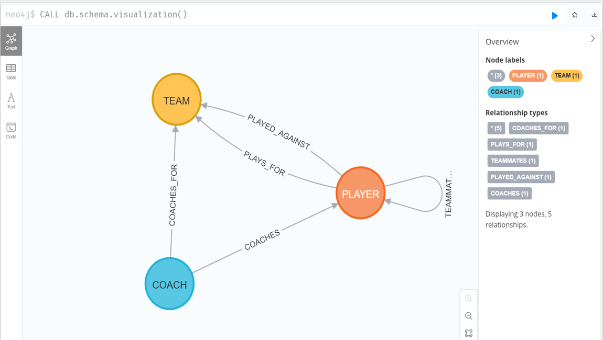
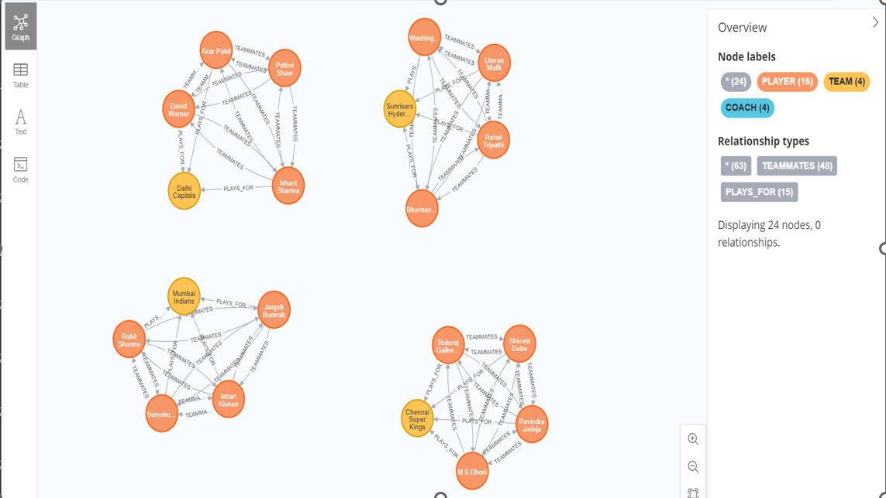

## Problem Definition:

The
Indian Premier League ( is a multifaceted cricket league, with numerous
components influencing its dynamics, including player performances, team
compositions, and coaching staff strategies Analyzing the interwoven relationships
within the IPL data is essential for understanding the factors contributing to a team's
success or failure and identifying potential improvements in technique, selection,
and performance
We
aim to examine the IPL data, focusing on the connections between players,
teams, and coaches, and uncover insights that can contribute to a deeper
understanding of the league's structure and performance trends We aim to answer
questions such as

How
do players' performances affect their teams' overall success?

How
does the coaching staff impact players' performances and team dynamics?

How
do team compositions and strategies evolve in response to various factors,
such as opponents' strengths and weaknesses?

Can
we identify patterns or trends that could be instrumental in devising effective
strategies for future matches?
By
addressing these questions, we intend to comprehensively analyze the IPL
ecosystem, revealing valuable insights and patterns that can potentially influence the
league's future trajectory

## Why is Graph Database the best fit for this problem:

A Graph Database is an exceptional choice for analyzing the Indian Premier League ( data
because it can efficiently model, store, and query complex relationships between various
entities It offers several advantages in the context of our problem

## 2. Intuitive:
Data Representation Graph Databases represent data as nodes ( and
relationships ( in a graph structure This realistic representation aligns perfectly with
the IPL's corresponding data, such as players, teams, and coaches, facilitating a more
accessible and comprehensive analysis

## 3. Scalability
The IPL data is vast and ever growing, with new players, teams, and matches
added each season Graph Databases are designed to handle large datasets and scale
efficiently, ensuring the analysis remains efficient and up to date

## 4. Efficient
Querying Graph Databases provide exceptional performance in querying
connected data This capability is crucial for exploring the IPL's intricate relationships and
answering complex questions about players' performances, team dynamics, and the
coaching staff's impact

## 5.Flexible
Data Model The IPL's structure and data are subject to change over time, with
evolving rules, team compositions, and strategies Graph Databases offer a flexible data
model that can quickly adapt to these changes, ensuring the analysis remains relevant and
accurate

By
leveraging the unique strengths of a Graph Database, we can delve deep into the IPL data,
uncovering valuable insights and patterns that can contribute to a better understanding

## Model Of Our Database:

## Relationships between Teammates:

## Conclusion

1. In this project, we leveraged the power of Neo4j, a graph database management system, to model and analyze the Indian Premier League (IPL) statistics. Through our graph database, we were able to efficiently store and represent complex relationships between various entities such as players, teams, and coaches. This enabled us to perform in-depth analyses and gain valuable insights into the performance of IPL teams and players over the years.

2. By utilizing Neo4j's powerful query language, Cypher, we executed a wide range of queries that showcased the flexibility and efficiency of graph databases in handling interconnected data. These queries included aggregations, filtering, and traversal of relationships, demonstrating the power of graph databases in dealing with complex data structures.

3. Our IPL database provides a foundation for further analysis and exploration, including examining player performance trends, identifying key factors that contribute to a team's success, and uncovering hidden patterns in the data. This project showcases the potential of using graph databases in sports analytics and paves the way for more advanced analytics and insights in the future.
